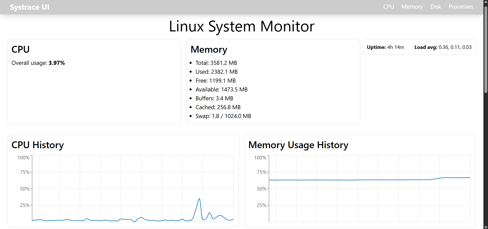
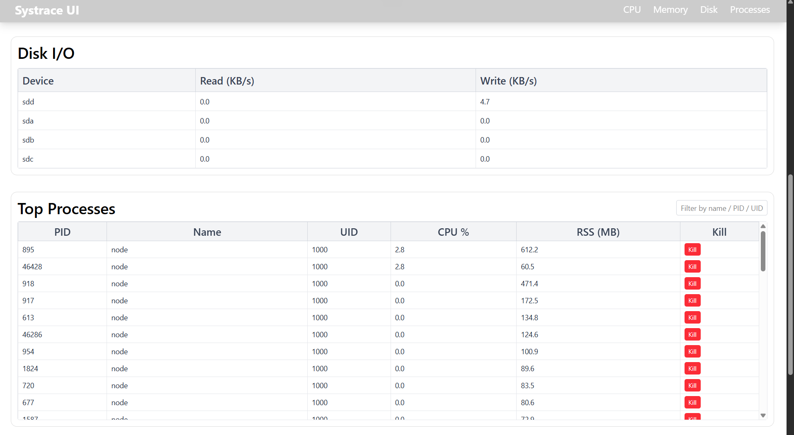

# 🖥️ Linux System Monitor (React + Node.js + /proc)

A real-time Linux system monitoring dashboard built using **React**, **Node.js**, and the **/proc filesystem**.  
It provides live updates of CPU usage, memory consumption, processes, disk I/O, uptime, and load averages — similar to **htop**, but with a modern web UI.

---

## 🚀 Features

### 🔹 Real-time Monitoring (updates every 2 seconds)
- CPU usage (overall + per-core)
- Memory usage (used, free, cached, buffers, swap)
- Disk I/O speeds in KB/s
- Process table showing PID, name, UID, CPU%, and RSS
- System uptime and load averages

### 🔹 Process Manager
- Kill any running process directly from the UI  
- Process filtering by name / PID / UID  

### 🔹 Modern & Responsive UI
- Built using **React + TailwindCSS**
- Dynamic graphs using **Recharts**
- Sticky table headers
- Fully responsive layout

### 🔹 Modular Backend
- Express-based REST API
- Reads system data directly from `/proc`
- Supports killing processes using `child_process.exec()`

---

## 🧰 Tech Stack

### **Frontend**
- React  
- TailwindCSS  
- Recharts  
- Fetch API  

### **Backend**
- Node.js  
- Express  
- `fs/promises`  
- `child_process.exec`  

### **Platform**
- Linux / WSL2  
- `/proc` virtual filesystem  

---

## 📁 Project Structure

```
project-root/
│
├── backend/
│   ├── src/
│   │   ├── index.js
│   │   ├── cpu.js
│   │   ├── memory.js
│   │   ├── processes.js
│   │   ├── summary.js
│   │   ├── disk.js
│   └── package.json
│
└── frontend/
    ├── src/
    │   ├── components/
    │   ├── App.jsx
    │   └── ...
    └── package.json
```

---

## 🔧 Installation

### **1️⃣ Backend Setup**

```bash
cd backend
npm install
npm start
```

Backend runs at:

```
http://localhost:4000
```

---

### **2️⃣ Frontend Setup**

```bash
cd frontend
npm install
npm run dev
```

Frontend runs at:

```
http://localhost:5173
```

---

## 🔌 API Endpoints

| Method | Route                       | Description                |
|--------|------------------------------|----------------------------|
| GET    | `/api/cpu`                   | CPU usage statistics       |
| GET    | `/api/memory`                | Memory usage stats         |
| GET    | `/api/processes`             | List of active processes   |
| POST   | `/api/processes/:pid/kill`   | Kill a process             |
| GET    | `/api/summary`               | Load averages & uptime     |
| GET    | `/api/disk`                  | Disk I/O rates             |

---

## 📊 How `/proc` is Used

| File                  | Purpose                                    |
|-----------------------|--------------------------------------------|
| `/proc/stat`          | CPU jiffy counters → CPU% calculation      |
| `/proc/meminfo`       | Memory stats (total/free/cached/buffers)   |
| `/proc/[pid]/stat`    | Process CPU ticks (utime, stime)           |
| `/proc/[pid]/status`  | UID, RSS                                   |
| `/proc/diskstats`     | Disk read/write sectors                    |
| `/proc/uptime`        | System uptime & idle time                  |
| `/proc/loadavg`       | Load averages (1, 5, 15 min)               |

---

## ⚙️ CPU & Memory Calculations

### **CPU % Calculation**

```
deltaIdle = idle_now - idle_prev
deltaTotal = total_now - total_prev
CPU% = (1 - deltaIdle / deltaTotal) * 100
```

### **Memory Usage Calculation**

```
used = MemTotal - (MemFree + Buffers + Cached)
```

---

## ⚙️ Disk I/O Calculations

```
KB/s = (Δsectors × 512) / 1024 / interval
```

---

## 🔥 Kill Process Implementation

### **Frontend**

```js
fetch(`http://localhost:4000/api/processes/${pid}/kill`, {
  method: "POST"
});
```

### **Backend**

```js
exec(`kill -TERM ${pid}`);
```

---

## 📸 Screenshots (Add Yours)

```



```

---

## 🛠️ Future Enhancements

- Dark mode  
- Alerts for high CPU/memory usage  
- Change process priority (renice)  
- GPU usage monitoring  
- Network monitoring (`/proc/net`)  
- Docker container statistics  

---

## 🏁 Conclusion

This project demonstrates understanding of:

- Linux `/proc` filesystem  
- Real-time system monitoring  
- Process management  
- Full-stack app development using React + Node.js  

A modern web alternative to command-line tools like **top** and **htop**.

---

## 👤 Author  
**Kapil Handeriya**  
IIT Goa – CSE  
